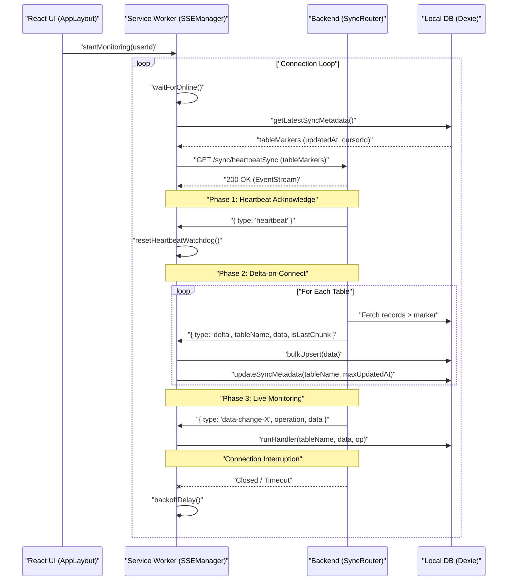

# SSE Architecture & Lifecycle

This document describes the design and operational logic of the Server-Sent Events (SSE) system used for real-time data synchronization.

## Overview
The SSE system is centralized in the **Service Worker** to ensure that data synchronization continues in the background, independent of which (or how many) tabs are open.

### Core Components
- **SSEManager ([sse.manager.sw.ts](file:///Users/krishna404/codeProjects/shipmyapp/connected-repo/apps/frontend/src/sw/sse/sse.manager.sw.ts))**: The central orchestrator running in the SW.
- **SyncRouter ([sync.router.ts](file:///Users/krishna404/codeProjects/shipmyapp/connected-repo/apps/backend/src/modules/sync/sync.router.ts))**: The backend handler that delivers deltas and live updates.
- **useConnectivity ([useConnectivity.sse.sw.ts](file:///Users/krishna404/codeProjects/shipmyapp/connected-repo/apps/frontend/src/sw/sse/useConnectivity.sse.sw.ts))**: The React hook that bridges the SW state to the UI.

---

## Connection Lifecycle

The following diagram illustrates the lifecycle of an SSE connection, including the "Delta-on-Connect" phase.

---

## Reconnection & Robustness

### 1. Heartbeat Watchdog
To prevent "zombie" connections where the socket is technically open but no data is flowing (common in mobile networks), the `SSEManager` implements a **Heartbeat Watchdog**.
- **Interval**: The server sends a `{ type: 'heartbeat' }` every 10 seconds.
- **Watchdog Timeout**: 30 seconds.
- **Mechanism**: Every received event (heartbeat or data) resets a timer. If it expires, the `SSEManager` forcibly aborts the current connection and restarts the loop.

### 2. Exponential Backoff
When a connection fails, the system avoids overwhelming the server using exponential backoff with jitter.
- **Initial Delay**: 1s
- **Max Delay**: 30s
- **Jitter**: 20% random variance to prevent "thundering herd" synchronization across multiple clients.

### 3. Delta-on-Connect (Checkpointing)
The system uses **Checkpoint-based Synchronization**. instead of a simple "fetch everything," the client sends `tableMarkers` representing the last successful sync point for every table.
- **updatedAt**: High-precision server timestamp.
- **cursorId**: ULID/UUID for breaking ties between records with the same timestamp.

---

## Edge Cases and Gotchas

| Case | Handling Logic | UI Impact |
| :--- | :--- | :--- |
| **401 Unauthorized** | The SW broadcasts `SSE_AUTH_ERROR` and **stops monitoring**. | `OfflineBanner` shows "Session Expired" with a non-dismissible Login button. |
| **Device Offline** | `waitForOnline()` pauses the loop using the `online` event listener. | `OfflineBanner` shows "No Network" banner. |
| **Server Restart/Death** | Watchdog detects silence or Fetch fails. Reconnection loop starts with backoff. | `OfflineBanner` shows "Server Offline" if health check fails. |
| **Membership Change** | Backend signals a critical membership update and closes the connection. | SW receives final delta, wipes local data if removed from team, and reconnects to refresh context. |

### Gotcha: Double Heartbeats
The server yields a heartbeat *immediately* upon connection and *between* table deltas. This is intentional to prevent the Service Worker watchdog from timing out during slow database scans on the backend.

### Gotcha: SSE in Development
Vite's HMR and Service Worker precaching can sometimes conflict. If SSE status hangs on `connecting`, verify that multiple instances of the SW aren't fighting for control in the Chrome DevTools `Application -> Service Workers` tab.
