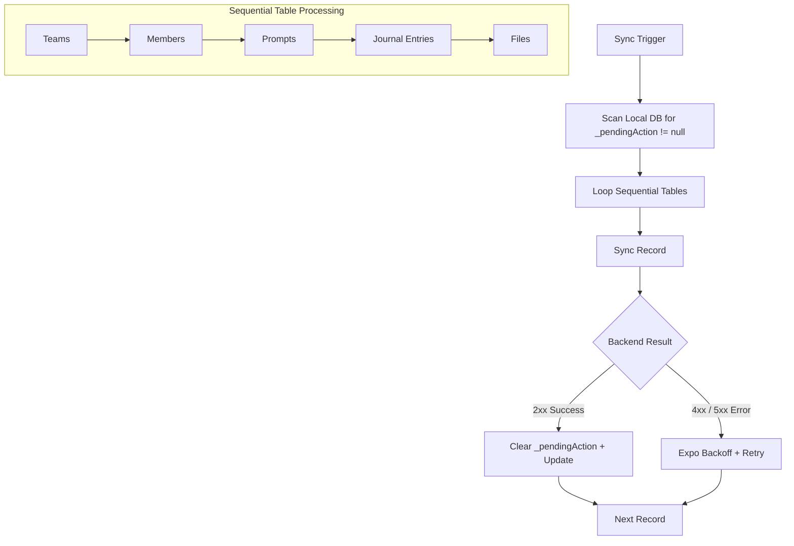
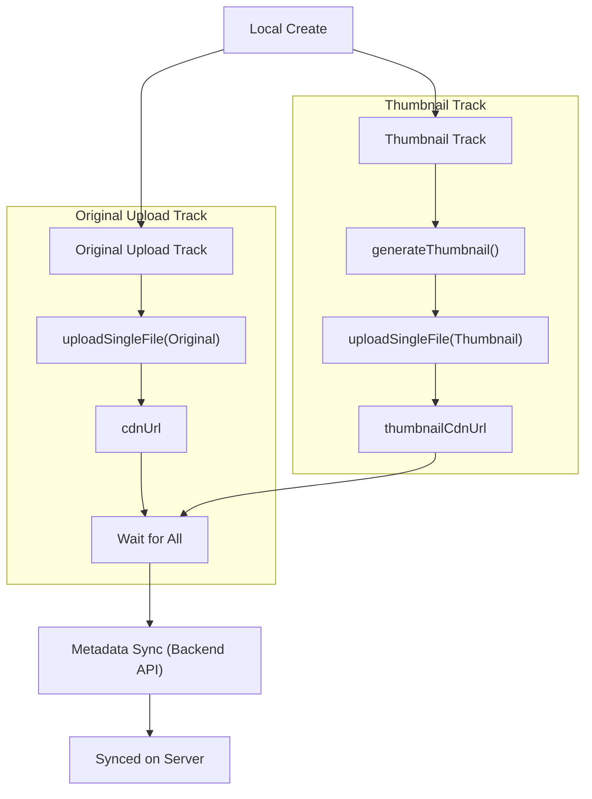

# Offline Data & Sync Logic

This document details the principles of "Offline-First" data management and the mechanics of the synchronization orchestration.

## Core Philosophy: Sync Integrity
To ensure absolute data consistency with minimal complexity, the system follows a strict **Mutation Barrier**:

1.  **New Data (Creations)**: Allowed offline. These records are assigned a `_pendingAction: 'create'` and synchronized when a connection is available.
2.  **Synced Data (Updates/Deletes)**: Allowed **online only**. Modifying an existing, already-synced record while offline is strictly prohibited. This eliminates the need for complex conflict resolution (CRDTs, Last-Write-Wins timestamps, etc.).

---

## Sync Orchestration Flow

The **SyncOrchestrator ([sync.orchestrator.ts](file:///Users/krishna404/codeProjects/shipmyapp/connected-repo/apps/frontend/src/worker/sync/sync.orchestrator.ts))** is responsible for pushing local changes to the server.

---

## Multi-Stage File Synchronization

Files (attachments) follow a specialized orchestration because they involve binary data and CDN interactions. To optimize for speed, original files are uploaded in parallel with thumbnail generation.

### The 3 Stages
1.  **Parallel Preparation & Upload**: 
    - **Original Upload**: Starts immediately.
    - **Thumbnail Generation**: Starts immediately in `MediaWorker`.
    - **Thumbnail Upload**: Starts as soon as the thumbnail is generated.
2.  **Wait for URLs**: The orchestrator waits for both the original `cdnUrl` and (if applicable) `thumbnailCdnUrl` to be received.
3.  **Metadata Sync**: Once all URLs are present, the metadata is synced to the backend database.

### Stage Flow

---

## Edge Cases and Gotchas

### 1. The "Ghost" Parent Problem
Since tables sync sequentially (Teams -> Journal Entries -> Files), a file might reach Stage 3 (Metadata Sync) before its parent Journal Entry has successfully synced on the server.
- **Handling**: The backend will reject the file metadata save with a `404 Parent Not Found`.
- **Resolution**: The `SyncOrchestrator` catches this, keeps the file in its current state, and retries in the next pass. By then, the Journal Entry will likely have synced.

### 2. The "Ghost Blob" Problem (Local Eviction)
A file may be registered in the local DB, but its source binary (`_blob`) is lost before it can be uploaded (e.g., manual DB clearing, browser storage eviction, or data corruption).
- **Handling**: The orchestrator checks for the existence of `_blob` before starting Stage 1. 
- **Current Behavior**: If the blob is missing, the orchestrator skips the file to avoid a crash. These "dead" records may need manual or background cleanup later.

### 3. Orphaned CDN Files
If a user deletes a file record locally *after* it has uploaded to the CDN but *before* the Metadata Sync (Stage 3) is finished.
- **Result**: The file remains in the CDN bucket with no reference in any database.
- **Resolution**: This is a known trade-off in offline-first systems (prioritizing data preservation). These are typically cleaned up by periodic backend garbage collection jobs that scan S3 for unreferenced objects.

### 4. Partial Sync (Binary vs Metadata)
A file might upload to the CDN successfully (Stage 1/2 complete) but fail the Metadata Sync (Stage 3).
- **Self-Healing**: On the next sync attempt, the orchestrator sees `cdnUrl` is already present. It **skips** the parallel upload track and jumps straight to Stage 3. This saves bandwidth and processing power.

### 5. Concurrent Sync Triggers
Multiple triggers (user clicks, SSE heartbeats, tab focus) might attempt to start a sync at the same time.
- **Protection**: `SyncOrchestrator` uses an internal `isProcessing` lock. If a sync is already running, it sets a `needsRescan` flag and exits immediately. Once the current loop finishes, it checks the flag to decide whether to start another full pass.

### 6. Worker Proxy Availability
The `DataWorker` relies on the `MediaWorker` for uploads and thumbnails. If a sync starts before the main thread has bridged them, the proxy might be null.
- **Reliability**: `worker.context.ts` uses an awaitable **Self-Updating Promise**. Any sync task requiring the media proxy will simply "wait" at the start of its execution until the bridge is established, ensuring no tasks are skipped due to race conditions.

### 7. Server-Time Authority
The client **never** uses its local clock for synchronization markers. All `updatedAt` values are assigned by the server. This prevents clock skew issues and ensures the "Zero-Gap" integrity of the Delta-on-Connect flow.

### 8. Direct Deletions
For synced records, deletion is an online-only operation.
- **Logic**: The client calls the delete API. If successful, it deletes the record from the local Dexie DB immediately. No "tombstone" markers are kept locally, as the server is the source of truth for synced data.

---

## Related Documentation
- [SSE Architecture & Lifecycle](../sw/sse/SSE_ARCHITECTURE.md)
- [Bimodal Documentation System](../../../.agent/rules/documentation-lifecycle.md)
