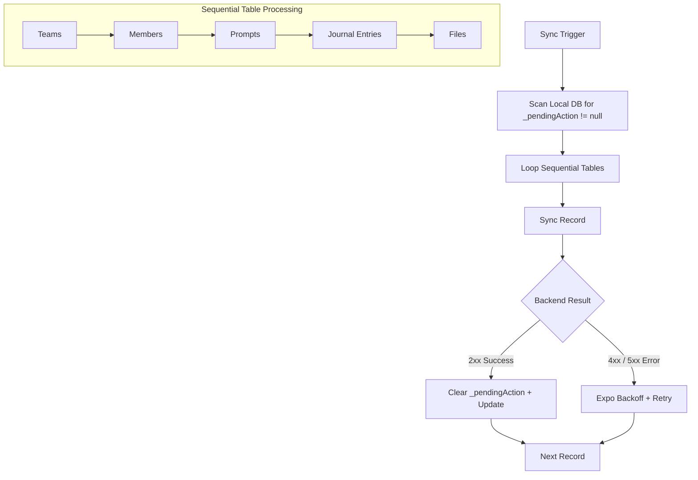

# Offline Data & Sync Logic

This document details the principles of "Offline-First" data management and the mechanics of the synchronization orchestration.

## Core Philosophy: Sync Integrity
To ensure absolute data consistency with minimal complexity, the system follows a strict **Mutation Barrier**:

1.  **New Data (Creations)**: Allowed offline. These records are assigned a `_pendingAction: 'create'` and synchronized when a connection is available.
2.  **Synced Data (Updates/Deletes)**: Allowed **online only**. Modifying an existing, already-synced record while offline is strictly prohibited. This eliminates the need for complex conflict resolution (CRDTs, Last-Write-Wins timestamps, etc.).

---

## Sync Orchestration Flow

The **SyncOrchestrator ([sync.orchestrator.ts](file:///Users/krishna404/codeProjects/shipmyapp/connected-repo/apps/frontend/src/worker/sync/sync.orchestrator.ts))** is responsible for pushing local changes to the server.

---

## Multi-Stage File Synchronization

Files (attachments) follow a specialized 3-stage orchestration because they involve binary data and CDN interactions.

### The 3 Stages
1.  **Thumbnail Generation**: Uses `MediaWorker` to generate thumbnails from images/PDFs.
2.  **CDN Upload**: Uploads the original file and thumbnail to the CDN. Returns CDN URLs.
3.  **Metadata Sync**: Sends the file metadata (including CDN URLs and table associations) to the backend database.

### Stage Flow

```mermaid
stateDiagram-v2
    [*] --> Stage1: "Local Create"
    Stage1 --> Stage2: "Thumbnail Ready"
    Stage2 --> Stage3: "CDN URLs Received"
    Stage3 --> [*]: "Synced on Server"

    state Stage1 {
        direction LR
        LocalFile --> MediaWorker: "generateThumbnail()"
        MediaWorker --> Result: "_thumbnailBlob"
    }

    state Stage2 {
        direction LR
        BinaryData --> CDN: "Upload Original"
        _thumbnailBlob --> CDN: "Upload Thumbnail"
        CDN --> CDN_URLs: "Success"
    }

    state Stage3 {
        direction LR
        Metadata_CDN_URLs --> BackendAPI: "POST /sync/file"
        BackendAPI --> DB_Record: "Save"
    }
```

---

## Edge Cases and Gotchas

### 1. The "Ghost" Parent Problem
Since tables sync sequentially, a file might reach Stage 3 (Metadata Sync) before its parent Journal Entry has successfully synced on the server.
- **Handling**: The backend will reject the file metadata save with a `404 Parent Not Found`.
- **Resolution**: The `SyncOrchestrator` catches this, keeps the file in Stage 3, and retries later. By then, the Journal Entry will likely have synced.

### 2. Partial Sync (Binary vs Metadata)
A file might upload to the CDN successfully but fail the Metadata Sync.
- **Result**: The file remains in Stage 3. On the next sync attempt, it **skips** the CDN upload (Stage 2) because it already has `cdnUrl`, and goes straight to Stage 3.

### 3. Server-Time Authority
The client **never** uses its local clock for synchronization markers. All `updatedAt` values are assigned by the server. This prevents clock skew issues and ensures the "Zero-Gap" integrity of the Delta-on-Connect flow.

### 4. Direct Deletions
For synced records, deletion is an online-only operation.
- **Logic**: The client calls the delete API. If successful, it deletes the record from the local Dexie DB immediately. No "tombstone" markers are kept locally, as the server is the source of truth for synced data.

---

## Related Documentation
- [SSE Architecture & Lifecycle](../sw/sse/SSE_ARCHITECTURE.md)
- [Bimodal Documentation System](../../../.agent/rules/documentation-lifecycle.md)
