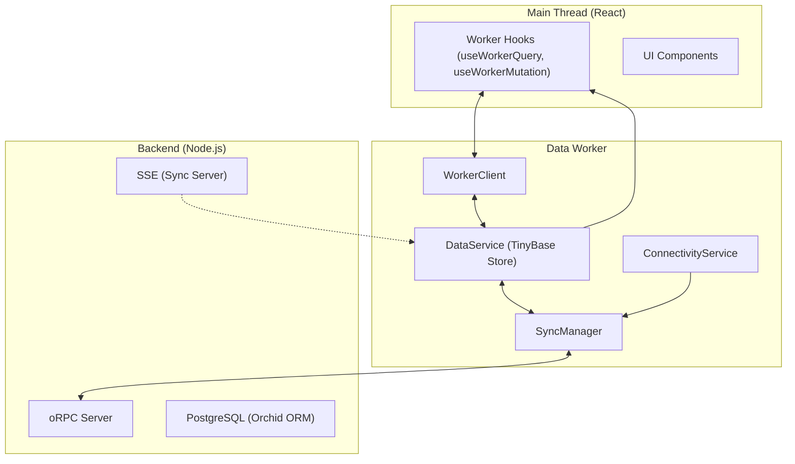

# Offline-First Sync Architecture

This document provides a detailed overview of the synchronization architecture implemented in the Connected Repo.

## Problem Statement

Traditional web applications rely heavily on a constant internet connection. When the connection is lost, the app becomes unresponsive or fails to perform basic operations. To provide a premium, mobile-like experience, we need an architecture that:

1.  Works offline seamlessly.
2.  Handles data synchronization in the background.
3.  Provides immediate feedback (optimistic updates).
4.  Ensures data consistency between client and server.

## Architectural Overview

The core of our solution is a **Web Worker based Data Layer** combined with **TinyBase** for local storage.

### 1. Data Worker & TinyBase

The **Data Worker** runs in a separate thread, offloading data management from the main React thread. It uses **TinyBase** as an in-memory database with persistence to IndexedDB.

- **Why TinyBase?** It's extremely fast, supports reactive updates, and has a built-in relational-like schema.
- **Why Web Worker?** Prevents UI jank by handling serialization, storage I/O, and complex sync logic away from the main thread.

### 2. Sync Engine (SyncManager)

The `SyncManager` is responsible for draining the `pending_entries` queue and applying server updates.

- **Draining Queue**: When online, the manager iterates through pending mutations and executes them on the server via oRPC. It uses **exponential backoff** for retries.
- **Delta Sync**: On startup or reconnection, the manager fetches only the changes since the last known timestamp (`lastSyncTimestamp`).
- **SSE Integration**: Server-Sent Events (SSE) broadcast changes from the backend. The worker relays these events to the data store for real-time reactivity.

### 3. Reactive UI (Worker Hooks)

We use custom hooks that bridge the React state with the Data Worker.

- `useWorkerQuery`: Similar to TanStack Query but reads from the local TinyBase store.
- `useWorkerMutation`: Wraps a mutation, stores it in the `pending_entries` table immediately, and triggers the `SyncManager`.

## Sync Flow (Mutation)

1.  **UI** calls `useWorkerMutation`.
2.  **Hook** sends a `mutation` request to the Worker.
3.  **Worker (DataService)**:
    - Creates a `pending_entry` in TinyBase.
    - Optimistically updates the local data table.
    - Notifies the Main Thread (via `table-changed` push event).
4.  **SyncManager** is triggered:
    - If online, it sends the mutation to the **oRPC Server**.
    - On success, it updates the local record with server-generated metadata and removes the `pending_entry`.
    - On failure, it schedules a retry.

## Approach Selection: Why not just use TanStack Query?

While TanStack Query is excellent for server state, it lacks built-in support for:
- Complex offline persistence with relational queries.
- Background sync that continues after the tab is closed (via SW integration).
- Deep reactivity for local-only changes without a round-trip.

By using TinyBase in a Worker, we gain full control over the persistence layer and synchronization logic, enabling a much smoother offline experience.
